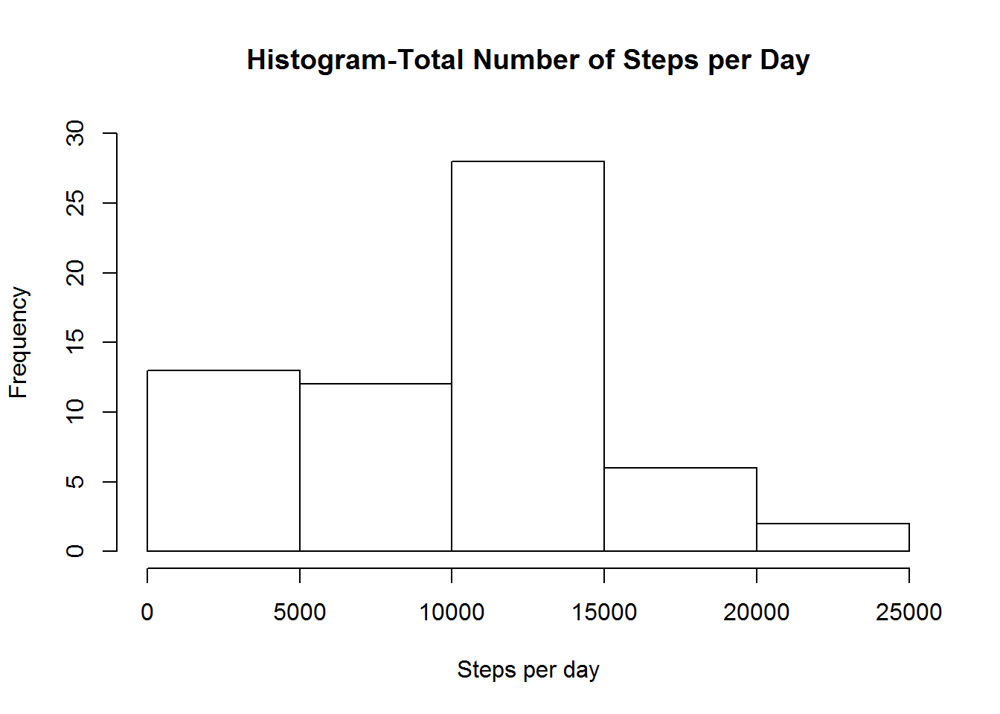
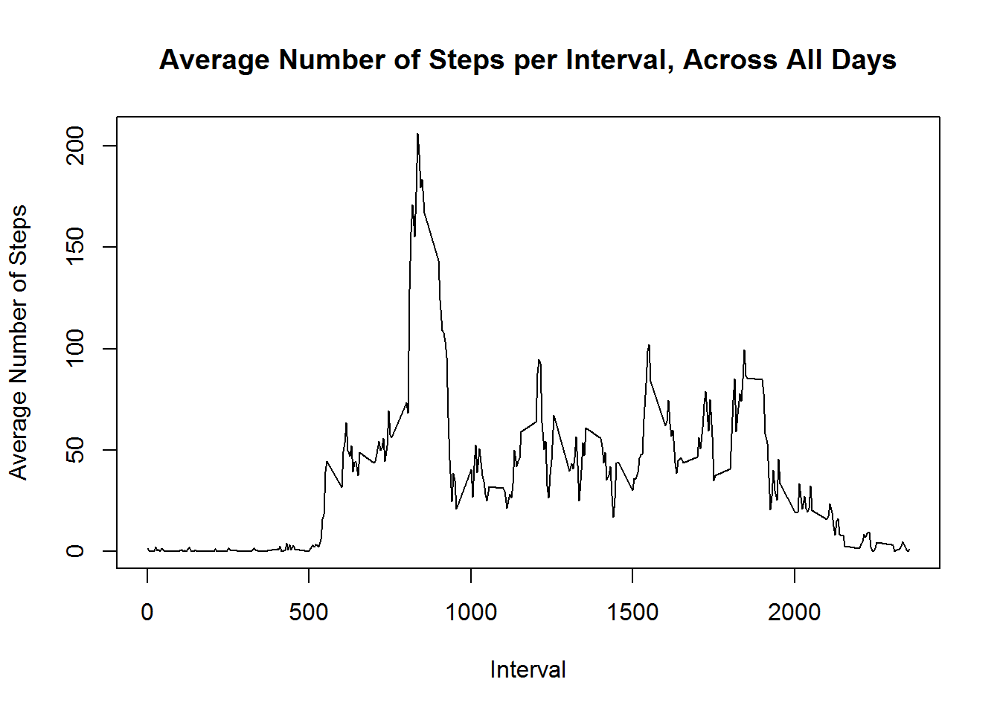
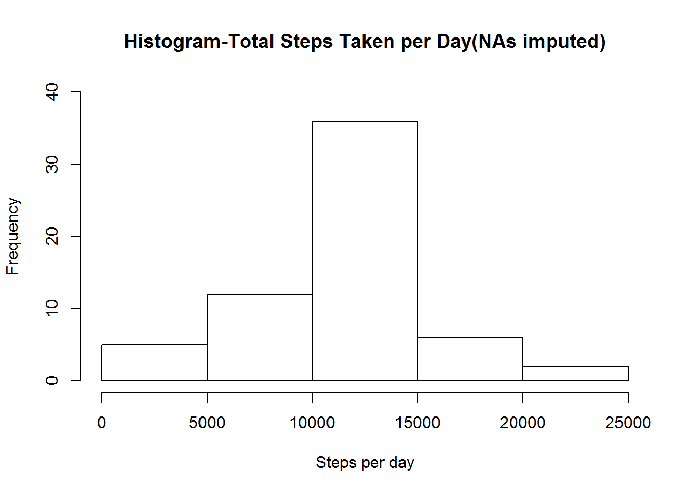
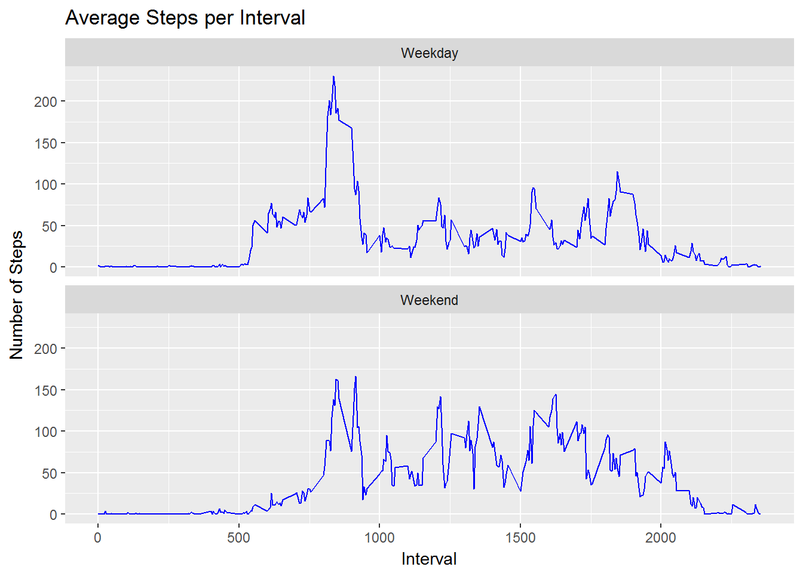

# PA1_template.Rmd
Sylvia Perez  
December 29, 2016  
# Peer-graded Assignment:  Course Project 1
## Reproducible Research Course

This report takes a close look at data from a personal activity monitoring device. The data consists of two months of data from an anonymous individual collected during the months of October and November, 2012 and includes the number of steps taken by the individual in 5 minute intervals each day during that time period.


Set the working directory:


```r
setwd("C:/Users/rainb/Documents/R")

getwd()
```

```
## [1] "C:/Users/rainb/Documents/R"
```


### Code for setting the global options to always show the programming code (unless otherwise indicated within any given chunk)


```r
knitr::opts_chunk$set(echo = TRUE,message=FALSE, warning=FALSE,fig.path='./figures/')
```


Load necessary packages:


```r
library(easypackages)

libraries("dplyr", "tidyr", "readr", "lubridate","ggplot2")
```


The dataset is read by the following code:

### Code for reading in the dataset


```r
unzip("repdata_data_activity.zip")
data <- read.csv("activity.csv")
```


## Part 1 - Mean Total Number of Steps per Day
We begin with the analysis by looking at the average steps taken per day over the two-month period, first evaluating the total number of steps per day over the study period, and then calculating and reporting the mean and median of the total number of steps taken per day.


```r
dailysteps <- data %>%
        group_by(date) %>%
        summarize(totalsteps = sum(steps, na.rm=TRUE))

hist(dailysteps$totalsteps, main="Histogram-Total Number of Steps per Day", xlab="Steps per day", ylab="Frequency", ylim=c(0,30))
```

<!-- -->

The mean of the total number of steps taken per day is:


```r
mean(dailysteps$totalsteps, na.rm=TRUE)
```

```
## [1] 9354.23
```

And the median for that same data is:


```r
median(dailysteps$totalsteps, na.rm=TRUE)
```

```
## [1] 10395
```


# Part 2 - Average daily activity pattern


```r
stepsperinterval <- data %>%
        group_by(interval) %>%
        summarize(intervalmean = mean(steps, na.rm=TRUE))
```


```r
plot(stepsperinterval$interval, stepsperinterval$intervalmean, type="l", xlab="Interval", ylab="Average Number of Steps", main="Average Number of Steps per Interval, Across All Days")
```

<!-- -->


The maximum average number of steps, across all days, was obtained in the following interval:


```r
maxinterval <- subset(stepsperinterval, intervalmean == max(intervalmean))
maxinterval
```

```
## # A tibble: 1 × 2
##   interval intervalmean
##      <int>        <dbl>
## 1      835     206.1698
```


# Part 3 - Imputing missing values


The total number of rows with missing values(NAs) in the dataset is:


```r
sum(!complete.cases(data)) 
```

```
## [1] 2304
```


For the sake of this assignment, missing values in the steps variable will be replaced with the mean for the corresponding time interval across all measured days, and a new dataset called 'newdataset' will be created with the missing values filled in.


```r
fulldata <- data %>%
        mutate(steps = as.numeric(steps)) %>%
        group_by(interval) %>%
        mutate(steps = ifelse(is.na(steps), mean(steps, na.rm = TRUE), steps)) %>%
        mutate(steps = round(steps, 2))
```


With the intent of comparing results from this "full" dataset to the original data, a histogram will be created with the total number of steps taken each day, and the mean and median number of steps taken per day will be calculated and reported.


```r
fulldatameans <- fulldata %>%
        group_by(date) %>%
        summarize(fulltotalsteps = sum(steps, na.rm=TRUE))

hist(fulldatameans$fulltotalsteps, main="Histogram-Total Steps Taken per Day(NAs imputed)", xlab="Steps per day", ylab="Frequency", ylim=c(0,40))
```

<!-- -->


The mean of the total number of steps taken per day is:


```r
mean(fulldatameans$fulltotalsteps, na.rm=TRUE)
```

```
## [1] 10766.18
```


And the median for that same data is:


```r
median(fulldatameans$fulltotalsteps, na.rm=TRUE)
```

```
## [1] 10766.13
```


When comparing this mean and this median with the values obtained in Part 1 of this assignment we observe that imputing the missing values increases the numbers somewhat.


# Part 5 - Evaluation of activity patterns
## (weekdays vs. weekends)


In order to evaluate whether there are differences in activity patterns between weekdays and weekends, a new factor variable with two levels, "weekday" and "weekend", needs to be created to then plot the activity and be able to analyze the information at these levels.


```r
fulldata$date <- as.Date(fulldata$date)

fulldata$day <- weekdays(fulldata$date, abbreviate=FALSE)

fulldata$daytype <- as.factor(ifelse(fulldata$day=="Saturday" | fulldata$day=="Sunday", "Weekend", "Weekday"))
```


Calculate the average number of steps taken on weekdays and weekends:


```r
daytypeinterval <- fulldata %>%
        group_by(daytype,interval) %>%
        summarize(intervalmean = mean(steps, na.rm=TRUE))
```


Plot the average number of steps per interval for weekdays and for weekends:


```r
ggplot(daytypeinterval, aes(interval,intervalmean))+geom_line(color="blue")+
        facet_wrap(~daytype, ncol=1, scales="fixed") + labs(x="Interval", y="Number of Steps") + ggtitle("Average Steps per Interval")
```

<!-- -->


